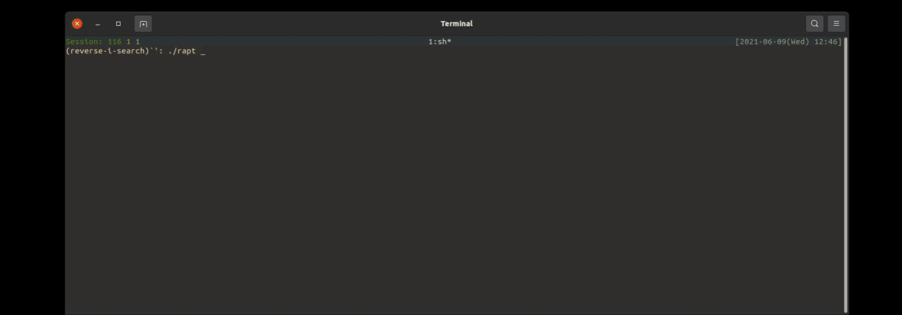

# 🚧 UNDER CONSTRUCTION 🚧
  
# RAPT: Simple Toy apt written in Rust
`rapt` is toy-version of `apt`(Debian Package Management System).  
`rapt` doesn't have much functionalities `apt` has for simplicity. `rapt` supports completely limited number of architectures or formats.
  

## Progress
| Status | Functionality |
| ------------- | ------------- |
| 🌤 | `rapt update` |
| 🌤 | `rapt show` |
| 🌤 | `rapt search` |
| 🌤 | `rapt list` |
| 🌤 | `rapt upgrade` |
| ⛈ | `rapt dist-upgrade` |
| ☁ | `rapt install` |
| ☁ | `rapt remove` |
| ⛈ | `rapt autoremove` |
| ⛈ | `rapt purge` |
| ☀ | `rapt clean` |
| ⛈ | `rapt autoclean` |
  
### legend
- ☀️: completed
- 🌤: almost done, still needs more impls 
- ☁️: work in progress
- ⛈: totally untouched

  

## Warnings
- DO NOT use `rapt` to install packages on actuall system. It might collapse package dependency.

## Docker Environment
- As stated above, `rapt` is just a toy and using `rapt install` might collapse the system.
- Use `run.sh` to try actuall installation. It creates a container and build `rapt` binary inside it. (it build debug version of `rapt`)