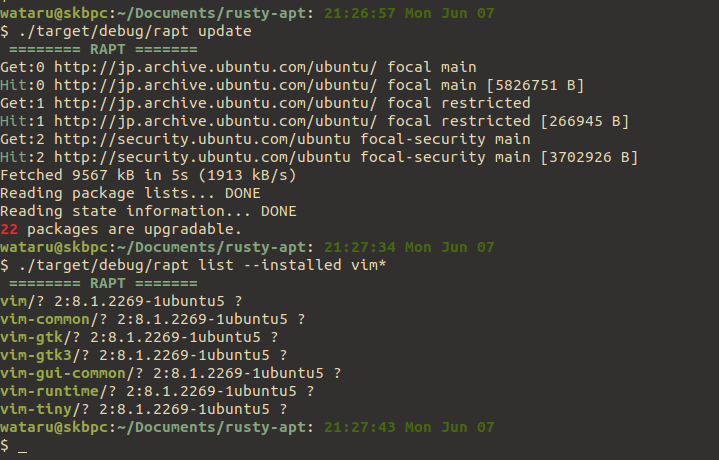

# 🚧 UNDER CONSTRUCTION 🚧
  
# RAPT: Simple Toy apt written in Rust
`rapt` is toy-version of `apt`(Debian Package Management System).  
`rapt` doesn't have much functionalities `apt` has for simplicity. `rapt` supports completely limited number of architectures or formats.
  

## warnings
- DO NOT use `rapt` to install packages on actuall system. It might collapse package dependency.